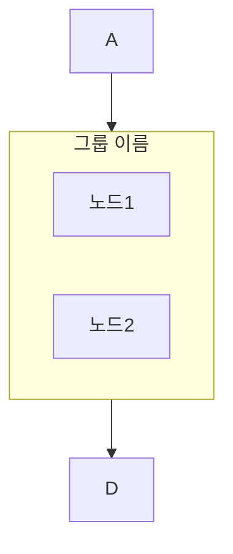
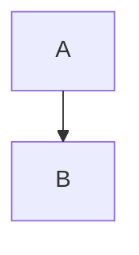

# Mermaid 다이어그램

## 렌더링 환경

docs-viewer는 **mermaid@11** (CDN 최신)을 사용한다. 문법 호환성에 주의.

## 방향 지정자

| 지정자 | 의미 | 호환성 |
|--------|------|--------|
| `TB` | Top to Bottom | 안전 |
| `BT` | Bottom to Top | 안전 |
| `LR` | Left to Right | 안전 |
| `RL` | Right to Left | 안전 |
| `TD` | Top Down (TB 별칭) | 11.x에서 불안정 — **사용 금지** |

```markdown
# 올바름
flowchart TB

# 틀림
flowchart TD
```

## 한국어 라벨

노드 라벨에 한국어 사용 가능. 단, 특수문자 조합 시 주의:

```mermaid
%% 올바름
A[한국어 라벨] --> B{조건 분기?}
B -->|예| C([완료])

%% 주의: 라벨 안에 괄호/중괄호 혼용 금지
```

## subgraph



**주의사항**:
- subgraph ID에 `-` (하이픈) 금지 → `_` (언더스코어) 사용
- subgraph 내부 노드는 연결 없이 나열 가능
- subgraph로의 연결은 subgraph ID 사용

## style 지시문


- `fill`, `color`, `stroke` 등 CSS 속성 사용
- hex 색상 코드 권장 (`#4a90d9`)
- 다크/라이트 테마 모두 가독성 확인 필요

## 지원 다이어그램 타입

| 타입 | 문법 | 비고 |
|------|------|------|
| flowchart | `flowchart TB` | 가장 많이 사용 |
| sequence | `sequenceDiagram` | API 흐름 |
| class | `classDiagram` | 클래스 관계 |
| state | `stateDiagram-v2` | 상태 전이 |
| er | `erDiagram` | DB 관계 |
| gantt | `gantt` | 일정 |

## ELK 레이아웃 엔진

docs-viewer에 `@mermaid-js/layout-elk` CDN이 등록되어 있어 ELK 사용 가능.
복잡한 다이어그램에서 dagre보다 노드 겹침이 적을 수 있지만, **사이클이 있는 흐름도에서는 노드 순서가 뒤바뀌는 문제**가 있음.

### 활성화 방법

다이어그램 frontmatter에 추가:



### ELK 옵션

frontmatter의 `config.elk` 아래에 설정:

```yaml
config:
  layout: elk
  elk:
    mergeEdges: false
    forceNodeModelOrder: true
    nodePlacementStrategy: BRANDES_KOEPF
    cycleBreakingStrategy: MODEL_ORDER
    considerModelOrder: NODES_AND_EDGES
```

| 옵션 | 기본값 | 가능한 값 | 설명 |
|------|--------|-----------|------|
| `mergeEdges` | `false` | `true`, `false` | 병렬 엣지 합침. `true`면 깔끔하지만 입출력 구분 안 됨 |
| `forceNodeModelOrder` | `false` | `true`, `false` | 코드 작성 순서대로 노드 배치 시도 |
| `nodePlacementStrategy` | `BRANDES_KOEPF` | `SIMPLE`, `NETWORK_SIMPLEX`, `LINEAR_SEGMENTS`, `BRANDES_KOEPF` | 노드 배치 알고리즘 |
| `cycleBreakingStrategy` | `GREEDY_MODEL_ORDER` | `GREEDY`, `DEPTH_FIRST`, `INTERACTIVE`, `MODEL_ORDER`, `GREEDY_MODEL_ORDER` | 사이클 처리 방식. 시작 노드 위치에 영향 |
| `considerModelOrder` | `NODES_AND_EDGES` | `NONE`, `PREFER_EDGES`, `PREFER_NODES`, `NODES_AND_EDGES` | 노드/엣지 순서 존중 정도 |

### 적합한 경우

- 노드가 많고 겹침이 심한 **단방향** 흐름도
- subgraph 내부 정렬이 중요한 경우

### 부적합한 경우

- **사이클이 있는 흐름도** (피드백 루프) — 노드 순서가 뒤바뀜
- 시작점/끝점이 명확해야 하는 다이어그램 — dagre가 나음

## 체크리스트

문서에 mermaid 다이어그램 추가 시:

- [ ] `flowchart TD` 대신 `flowchart TB` 사용
- [ ] subgraph ID에 하이픈 없음 (언더스코어 사용)
- [ ] 노드 ID는 영문 대문자/언더스코어
- [ ] 한국어 라벨은 `[]`, `{}`, `([])` 안에
- [ ] docs-viewer에서 렌더링 확인
- [ ] ELK 사용 시: 사이클 유무 확인 (사이클 있으면 dagre 권장)
