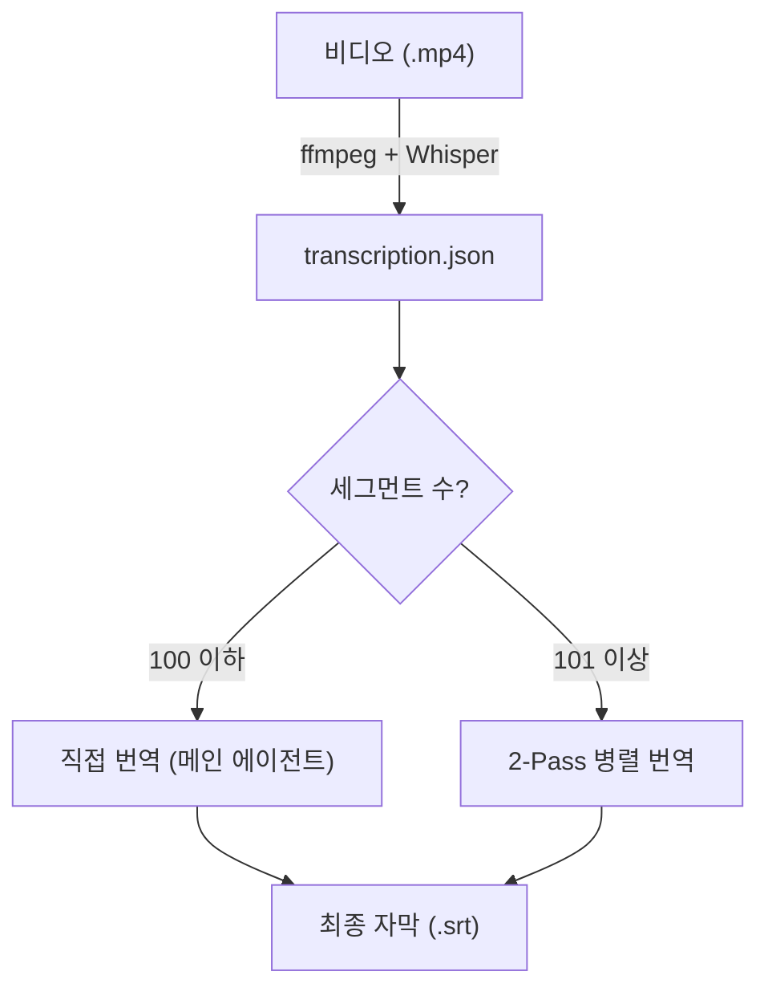
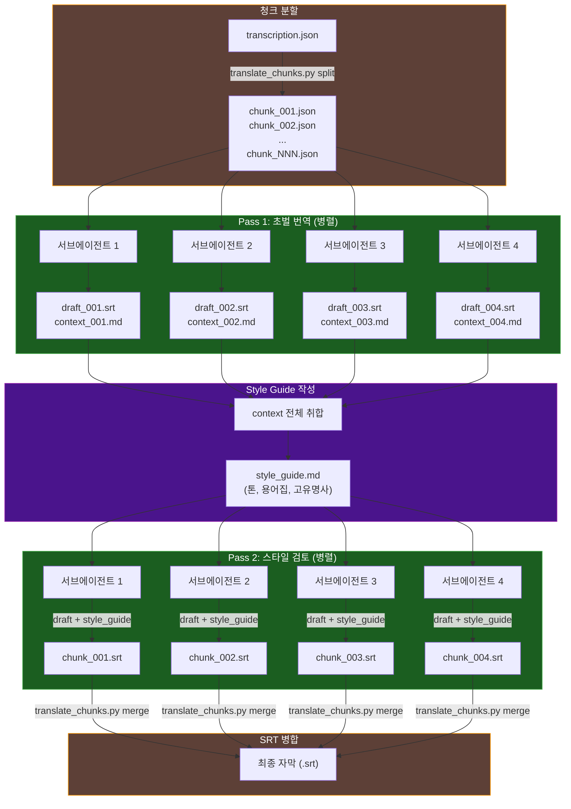

# 비디오 자막 파이프라인

breadcrumb: [[index|Transhub]] > [[architecture-index|Architecture]]

## 개요

`/video-subtitle` 스킬은 비디오 파일에서 한글 자막(SRT)을 자동 생성한다. 세그먼트 수에 따라 두 가지 경로로 분기된다.

## 전체 데이터 흐름



## 스크립트

| 스크립트 | 역할 | 입력 | 출력 |
|----------|------|------|------|
| `transcribe.py` | 비디오에서 오디오 추출 + Whisper STT | `.mp4` | `.transcription.json` |
| `translate_chunks.py split` | JSON을 청크로 분할 + 노이즈 필터링 | `.transcription.json` | `chunk_NNN.json` + `manifest.json` |
| `translate_chunks.py merge` | 청크 SRT를 최종 SRT로 병합 | `chunk_NNN.srt` | `.srt` |

## 서브에이전트 흐름 (2-Pass 병렬)

101개 이상의 세그먼트가 감지되면 2-Pass 병렬 파이프라인이 작동한다. 메인 에이전트가 서브에이전트를 오케스트레이션한다.



## 단계별 상세

| 단계 | 실행 주체 | 도구 | 배치 크기 | 산출물 |
|------|-----------|------|-----------|--------|
| STT | 메인 에이전트 | `transcribe.py` | - | `transcription.json` |
| 분할 | 메인 에이전트 | `translate_chunks.py split` | - | `chunk_NNN.json` + `manifest.json` |
| Pass 1 | 서브에이전트 (병렬) | Claude Code Task tool | 최대 4개 | `draft_NNN.srt` + `context_NNN.md` |
| 스타일 가이드 | 메인 에이전트 | 직접 작성 | - | `style_guide.md` |
| Pass 2 | 서브에이전트 (병렬) | Claude Code Task tool | 최대 4개 | `chunk_NNN.srt` |
| 병합 | 메인 에이전트 | `translate_chunks.py merge` | - | 최종 `.srt` |

## 에이전트 구조

```
사용자
  |
  +-- /video-subtitle 호출
  |
  v
메인 에이전트 (SKILL.md 파이프라인)
  |
  +-- [Python] transcribe.py        -- STT
  +-- [Python] translate_chunks.py  -- 분할/병합
  |
  +-- [Task tool] 서브에이전트 x4   -- Pass 1 (초벌 번역)
  +-- [직접] style_guide.md 작성    -- 문맥 취합
  +-- [Task tool] 서브에이전트 x4   -- Pass 2 (스타일 검토)
  |
  +-- 결과 보고 + 중간 파일 정리
```

## 파일 라이프사이클

작업 중 `<비디오명>_chunks/` 디렉토리에 중간 파일이 생성되며, 완료 후 정리된다.

```
작업 중:
  <비디오명>_chunks/
  +-- manifest.json        <-- split
  +-- chunk_001.json       <-- split
  +-- chunk_002.json       <-- split
  +-- draft_001.srt        <-- Pass 1
  +-- draft_002.srt        <-- Pass 1
  +-- context_001.md       <-- Pass 1
  +-- context_002.md       <-- Pass 1
  +-- style_guide.md       <-- 메인 에이전트
  +-- chunk_001.srt        <-- Pass 2
  +-- chunk_002.srt        <-- Pass 2

최종 산출물 (정리 후):
  <비디오명>.mp4            <-- 원본
  <비디오명>.srt            <-- 자막
```

## 재개 가능 구조

파이프라인의 각 단계는 이미 생성된 파일을 감지하면 스킵한다.

| 파일 존재 시 | 스킵 단계 |
|-------------|-----------|
| `transcription.json` | STT |
| `_chunks/manifest.json` | 분할 |
| `draft_NNN.srt` + `context_NNN.md` | 해당 청크 Pass 1 |
| `chunk_NNN.srt` | 해당 청크 Pass 2 |

세션이 중단되어도 처음부터 다시 시작할 필요 없이 중단된 지점부터 재개된다.

## 관련 문서

| 문서 | 설명 |
|------|------|
| [[arch-overview]] | 프로젝트 구조, 의존성 |
